<!-- headingDivider: 1 -->
<!-- paginate: true -->
<!-- footer: 主専攻実験第1回課題発表 -->

# 主専攻実験 第1回課題発表

学籍番号: 202011061
氏名: 岡部 純弥

# 概要

- パズルとして **ボンバーパズル** を選択

# パズルのルール

# パズルのルール

- 盤面上の **爆弾の位置** を全て決定する
- 各マスにはただ1つの爆弾が **ある** か **ない** か
- 数字は周囲8マスに埋まっている爆弾の数を表す
- 数字が書かれているマスには爆弾は **ない** 

# 変数の定義

- $(n+2)\times (n+2)$ の盤面 $A$
- 爆弾がマス $(i,j)$ にある := $A(i,j) = 1$ 
- マス $(i,j)$ の数字が $N$ := $B(i,j)=N$

盤面を $(n+2)\times (n+2)$ とする理由は，定式化の際の場合分けをなくすため（後述）

# 定式化

## 制約条件

TODO: 左揃え

$$
\forall A(i_n, j_n) \in S;\quad A(i_n, j_n) = 0 \\
\forall A(i_n, j_n) \in S;\quad \sum_{k=-1}^1\sum_{l=-1}^{1}A(i_{n+k},j_{n+l})=B(i_n,j_n)\\
$$

## 目的関数

$$
\text{minimize}\  1
$$

# 計算機実験の結果

## 実装

- 最適化プログラム
- ランダムな初期盤面を生成するプログラム
- ランダムな **実行可能解の存在する** 初期盤面を生成するプログラム

# 計算機実験の結果

## 結果

# まとめ

# 今後の課題

## ゲームルールの拡張

- 1マスに爆弾が2つ埋まっている
- 数字が書かれているマスに爆弾が埋まっている

## 盤面を画像化するジェネレーターの実装

# その他

- GitHub リポジトリ: https://github.com/Okabe-Junya/MajorExperimentsA